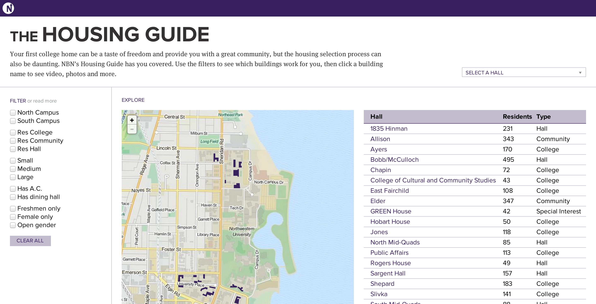

###### Note: This was originally published on <a href="http://source.mozillaopennews.org/en-US/articles/lessons-running-my-first-news-apps-team/" target="_blank">Source</a>.

Last week, I launched my first team-developed [news app](http://www.northbynorthwestern.com/housing) with a group of amazing student news nerds and peers: [Hilary Fung](http://www.twitter.com/hil_fung), [Dan Hill](http://www.twitter.com/danhillreports), [Rebecca Lai](http://www.twitter.com/kkrebeccalai), [Sheng Wu](http://www.twitter.com/shenghis) and [Katie Zhu](http://www.twitter.com/ktzhu). We developed [a housing guide](http://www.northbynorthwestern.com/housing) for incoming freshmen to Northwestern University who are in the process of applying for freshman housing. It includes an interactive map of campus, filters to narrow down housing options, photos and videos of each hall, quotes from current residents and basic statistics including number of students, room size, cost and distance to key campus locations.

The project, annually published by [North by Northwestern](http://www.northbynorthwestern.com), has existed in some form or another since 2008 and has been developed by rock stars like [Tom Giratikanon](http://www.twitter.com/giratikanon) (the site’s founder), [Sisi Wei](http://www.twitter.com/sisiwei) and [Emily Chow](http://www.twitter.com/eschow). For the past two years, the project has fallen on my shoulders as the publication’s former interactive editor and current webmaster.

Last year, I foolishly undertook the development process all by myself. The final result was [somewhat embarrassing](http://www.northbynorthwestern.com/story/the-2012-freshman-housing-guide/), a barely functional mess of a Canvas-based map with a whole bunch of ugly JavaScript to go with it. It was all I could manage as a _much_ more limited programmer without the access or technical ability to break free of our Django-based CMS.

This year was going to be different. I learned my lesson. I would get help. I would get people better and smarter than me to develop alongside me, and together, we could develop the app I truly wanted to make.

First of all, we needed to present the reporting, photography and videography of nearly _50 student reporters_ in the best light possible. They work too hard for the app itself to let them down. After some discussion, the team decided the best solution was a fully independent Django app. Our potential users, incoming freshmen, would use this application from anywhere in the world with any kind of device, so we needed something responsive. We wanted to provide basic information and accurate data on each hall. However, we knew that our advantage over standard university advertisement had always been the opinions of current residents on each dorm and the deep level of access we had to all of the facilities. Thus, we wanted to emphasize the character of every residence hall in this edition of the guide as well.

I think we accomplished all of those things. But it wasn’t easy, even with the ridiculous talent on the team. In my first role as a lead on a _team_ of developers, I learned a lot of lessons. Here are some of them.

## Set early content deadlines and meet them.

One of the best decisions we made early on was to get all content ready weeks in advance. Of course, small changes continued to be made up to the night of publication, but this allowed us to be in a place where we could develop with real data. The inevitably late content still came in at a time that was manageable to integrate in the development process. In a Django environment, we were able to fine-tune our models to our content so that we had nothing extraneous.

This helped our design process too. We knew exactly what we had to work with, so even our initial mockups were fairly accurate. We could iterate and find the best place for each piece of content we had. In a responsive context, we could orchestrate our content in a way that made sense on every device we tested on. On the dorm detail pages, we could play with many iterations of content choreography. In the end, we chose to put the vital statistics (dorm size, location, amenities) in the left rail for a desktop size, but we forced that content below the multimedia elements on mobile. Before we reached that solution, the vital statistics section existed on just about every other area of the page. Knowing what we had early helped us find the proper placement.

Of course, meeting our content deadlines was only possible because of the project’s phenomenal editors: [Denise Lu](http://www.twitter.com/denisedslu) and [Megan Thielking](https://twitter.com/meggophone).

## Use spreadsheets because they rule.

To populate our database with our content, our editors filled out a spreadsheet with all of the information we needed, including each individual quotation from a student, an embed code for each video and a link to every photo to go in our slideshows. It was a comprehensible way for them to make sure the right content got into the development team’s hands. And for us, it just took a few [django-csvimport](https://github.com/edcrewe/django-csvimport) commands to get the database running. The smoothness of this process makes me excited to find a project for something like [Tarbell](http://tarbell.tribapps.com/readme/).

## Pair programming is awesome. Do it often.

Operating on different schedules, we found it hard for all of us to meet in the same place at the same time and hack on the project. This made our code go in many divergent paths before it finally all came back together with about a week until publication. In that last week, I met with just about every member of the team individually for a few hours, and we paired on whatever aspect of the project they were responsible for.

Perhaps it was the threat of deadlines looming over us, but those pairing sessions were ridiculously productive, and I wish I had started having those sessions earlier in the development process. Having me there as the common element between the sessions helped unify the code and make sure everything that needed to get done was completed. I may not have written every line of code, but I saw most of them get written and approved of them.

## Ask for data and sometimes, ye shall receive.

As a student journalist, I know covering a private university is hard. Private universities have very little responsibility to disclose what they do, and they generally have no reason to tell student journalists (or any journalists) anything more. With the housing guide, we have often been limited as to what information we could provide because, discouraged from so many other stories, we never asked for the data. But this time, Northwestern’s Residential Services cooperated with us in the interest of providing accurate information on all fronts to incoming freshmen.

Thanks to their data, we could provide accuracy on the number of residents in each hall and what types of rooms are available. We were able to provide clarity on the different types of options available for freshmen. The relationship was mutually beneficial, and as student journalists at private universities, we should look for more relationships like this one where we can practice with data and use it to make something worthwhile.

## Assign roles based on expertise, but get everyone involved in everything.

Dan knows his way around a map. Hilary and Rebecca are fantastic designers. Sheng and Katie have a wealth of full-stack development experience. It was easy for me to assign responsibilities to each member of the team based on his or her expertise, and that general structure ensured things got done.

But this experience was meant to teach as well as produce. So when Dan was ready to incorporate his map into the design, we showed him the [grid system we used](http://www.inuitcss.com) to make the responsive magic happen. When it was time to get Hilary’s design templated into Django, we did it by showing her how the models and views worked so she could begin writing template tags herself. They all came out of this experience with more knowledge than when they agreed to help out over a month ago, or at least I hope so.

## Test with force.

The first live day for this app was not great, and most of the blame for the problems lay with me. I made a few dumb mistakes in the Django app that caused the entire server, not just the guide, to crash. The dumbest one was this: to make the map, I decided it was a good idea (despite protest from smarter members of the team) to run a Django view through a jQuery AJAX request that turned the GeoDjango Multipolygons into GeoJSON data that Leaflet could parse. This made our Varnish cache useless, forcing a request to the application on every single page view. Naturally, the server crashed four times in two hours.

Thanks to a massive assist from [Jeremy Bowers](http://www.twitter.com/jeremybowers), I baked out the JSON to static files on S3 and used those to make the AJAX request. I could have avoided this whole problem if I load tested the application with any bit of force. I figured we wouldn’t get enough traffic for the Django requests to matter, but even a few thousand page views crashed our server. I would have known that if I did some load testing before deployment.

## Have individual humility and group hubris.

This is the best project I have ever been a part of, leader or not, and that is because I worked with a team of my most talented friends together to work towards an achievable goal. I didn’t try to do this all by myself. Instead, we had a group-wide hubris that pushed our boundaries as developers and designers. As a team, we shot for a professional-grade news application, and, in my ever-so-biased opinion, we succeeded.
