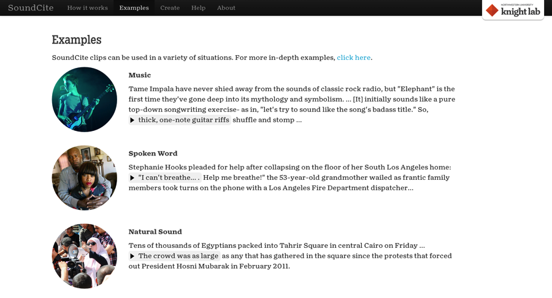
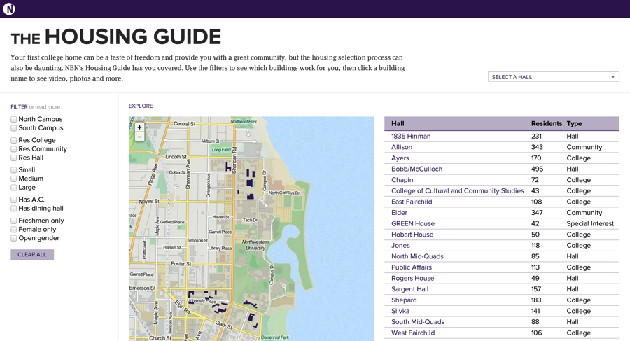
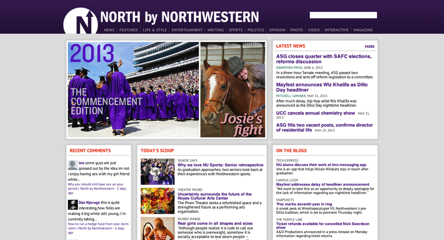
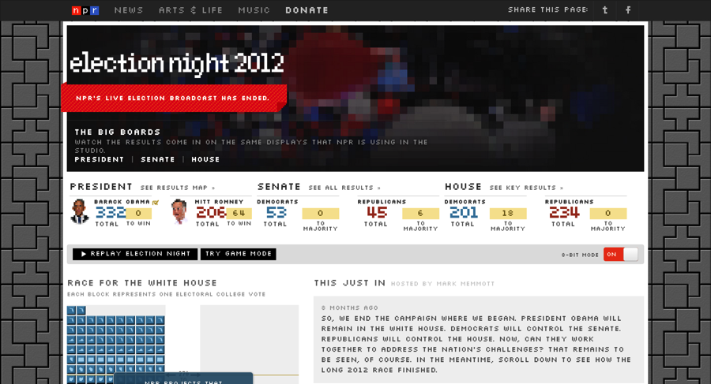
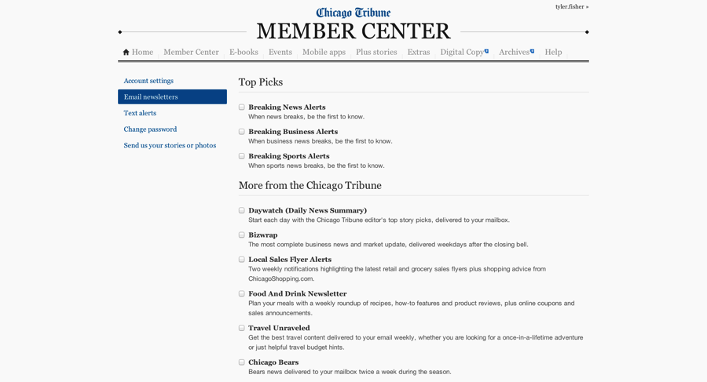
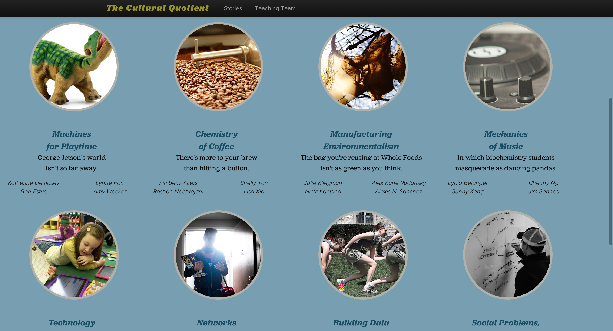

<link href='//cdn.knightlab.com/libs/soundcite/latest/css/player.css' rel='stylesheet' type='text/css'>

    <h1><a href="http://soundcite.knightlab.com" target="_blank">SoundCite</a></h1>

    <figure>
        
        <figcaption>June 2012 - June 2013</figcaption>
    </figure>

    
I created and developed <a href="http://soundcite.knightlab.com" target="_blank">SoundCite</a> with the <a href="http://knightlab.northwestern.edu" target="_blank"> Northwestern University Knight Lab</a> from 2012&#8211;2013. SoundCite connects to SoundCloud and allows a user to create embeddable, inline audio clips like this. The tool is meant to be friction-free and usable by journalists and publishers with absolutely no programming experience.

    <h1><a href="http://www.northbynorthwestern.com/housing" target="_blank">NBN Housing Guide</a></h1>

    <figure>
        
        <figcaption>April 2013 - May 2013</figcaption>
    </figure>

    
With a team of <a href="http://source.mozillaopennews.org/en-US/articles/lessons-running-my-first-news-apps-team/" target="_blank">six developers</a>, I rebuilt the annual North by Northwestern Housing Guide from the ground up as a Django app. It is fully responsive and uses <a href="inuitcss.com" target="_blank">inuit.css</a> as a framework. The app seeks to introduce Northwestern's incoming freshmen to their housing options as they fill out their housing applications.

    <h1><a href="http://www.northbynorthwestern.com" target="_blank">North by Northwestern</a></h1>

    <figure>
        
        <figcaption>September 2012 - Present</figcaption>
    </figure>

    
I am the current webmaster of <a href="http://www.northbynorthwestern.com" target="_blank">North by Northwestern</a>, Northwestern University&#8217;s leading online independent publication. Recently, I completed a server migration from Webfaction to Digital Ocean, including installing an nginx, uWSGI and varnish stack that serves the pubilcation&#8217;s custom Django app.

     <h1><a href="http://elections2012.npr.org" target="_blank">NPR Elections 2012 (8-Bit)</a></h1>

    <figure>
        
        <figcaption>November 2012 </figcaption>
    </figure>

    
Over the weekend before the 2012 presidential election, I built a CSS layer with Medill professor Jeremy Gilbert that made <a href="http://elections2012.npr.org" target="_blank">NPR's news app</a> look a little more like Tetris with some classic 8-bit styles and a MIDI version of "Hail to the Chief." Turn on "8-bit mode" to see the magic!

    <h1><a href="http://members.chicagotribune.com" target="_blank">Chicago Tribune</a></h1>

    <figure>
        
        <figcaption>July 2012 - August 2012</figcaption>
    </figure>

    
While interning with the <a href="http://blog.apps.chicagotribune.com" target="_blank">Chicago Tribune News Applications Team</a>, I helped build out the Member Center that allows subscribers of the Tribune to customize their experience and access extra content. This required reverse engineering some archaic APIs and fully introducing myself to Bootstrap.

    <h1><a href="http://www.theculturalquotient.com" target="_blank">The Cultural Quotient</a></h1>

    <figure>
        
        <figcaption>April 2013 - June 2013</figcaption>
    </figure>

    
I served as a "Resident Student Guru", or a teaching assistant, for Jeremy Gilbert and Emily Withrow's <a href="http://www.medill.us/13SP-Unclass/" target="_blank">web producing class</a> in the Medill School of Journalism. We taught 32 undergraduates, and I gave specific lectures on information design, parallax scrolling and CSS preprocessing. I also assisted with the introductory JavaScript lessons and advised the teams with programming issues they had with the stories they created.

